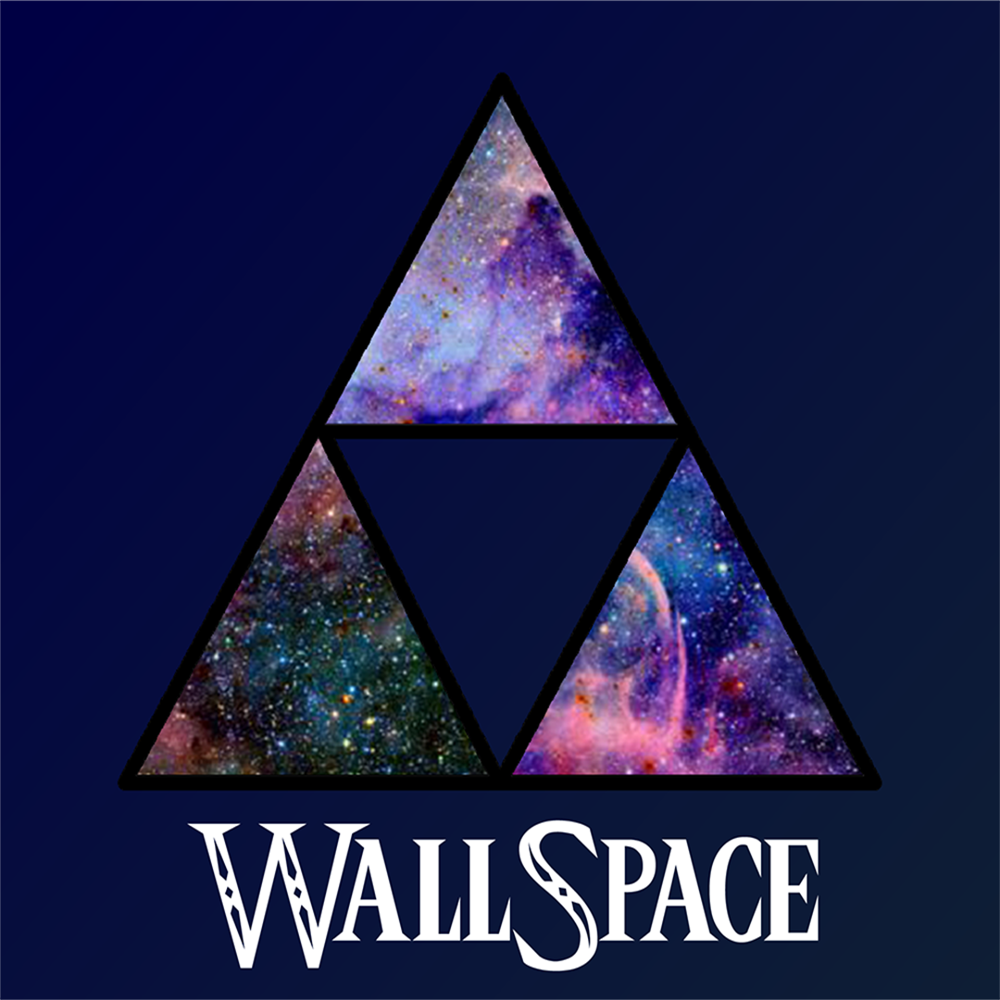
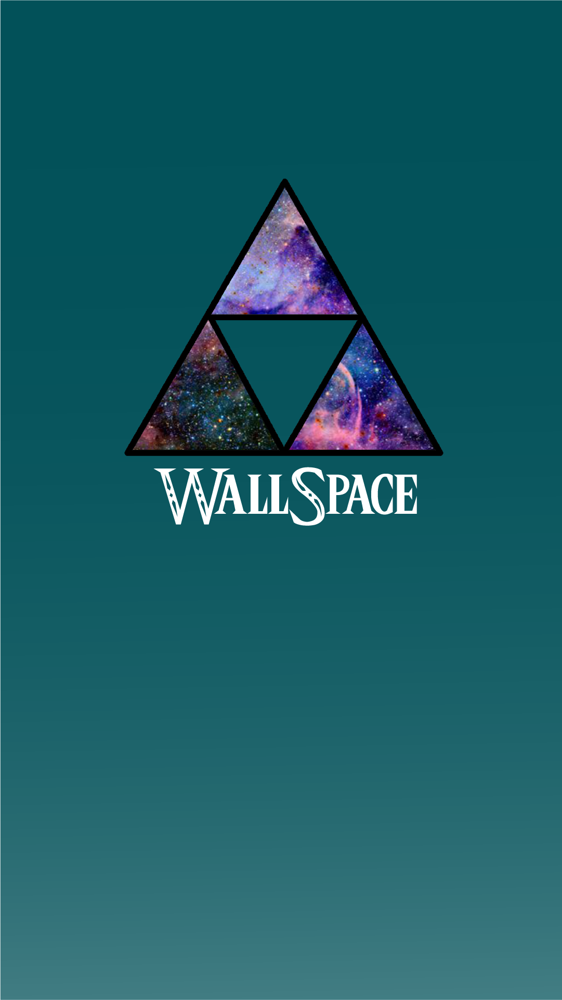

# WallSpace
Es una aplicación que implementa un sistema para agregar, buscar, modificar y eliminar wallpapers, que se encuentran
en la galería de la aplicación en la pantalla de añadir.

# Creadores

 <strong>Wilmer Josué García</strong> 

 <strong>Christian Orlando Mejía</strong> 

# Icono

 

 

# Imágenes del proyecto
# ¿Cómo funciona?
- Al ingresar a la aplicación se encuentra con la pantalla principal que muestra los últimos wallpapers que fueron añadidos.

 Se encuentra un menú en la parte superior izquierda, que redirige a otras pantallas que se encargan de añadir, eliminar

- <strong>Pantalla de añadir</strong>  
  Se encuentran imágenes en el sistema que pueden ser añadidas utilizando el código que tienen debajo. 
  
- <strong>Pantalla de eliminar</strong>  
  

- <strong>Pantalla de búsqueda</strong>  

- <strong>Pantalla de editar</strong>  

# Tecnologías utilizados 

- React Native
- Javascript

# Aplicaciones utilizadas

- Android Studio
- Adobe Photoshop
- Adobe Illustrator
- Adobe Color

# Recursos 
- Paleta de colores

 

- Tipografía
  * Triforce
  * Roboto (requerida por el componente de un botón de la librería <code>native-base</code>)
  
# Instrucciones para la instalación de los recursos de expo
Para clonar el repositorio y poder utilizar la aplicación de forma correcta necesita tener instalado <code>node</code>, <code>npm</code>, 
<code>expo-cli</code> y <code>sqlite</code> de manera global en la computadora. 

# Intalación
- Primero debe instalar Node.js  
Utilice el siguiente enlace:  
<code><a href="https://nodejs.org/en/download/">Node.js</a></code>

- Instalar los recursos de expo y npm  
<code>npm install</code>  
<code>npm install -g expo-cli exp</code> 
<code>npm i react</code> 
<code>npm i react-native</code> 
<code>npm i native-base</code> 
<code>npm i expo-font</code> 
<code>npm i react-native-gesture-handler</code> 
<code>npm i @react-navigation/native</code> 
<code>npm i @react-navigation/stack</code> 
<code>npm i react-navigation-stack</code> 
<code>npm i react-native-screens</code> 
<code>npm i @react-native-community/masked-view</code> 

- Instalar expo-sqlite 
<code>npm i expo-sqlite</code>  

- Iniciar Expo Metro:  
<code>expo start</code>

# Documentación 
- Corrección del Fallo VirtualizedList-backed 
https://nyxo.app/es/fixing-virtualizedlists-should-never-be-nested-inside-plain-scrollviews/

- Fuente Triforce 
https://www.dafont.com/es/triforce.font

- Documentación de sqlite 
https://docs.expo.io/versions/latest/sdk/sqlite/

- Columnas en Flatlist  
https://stackoverflow.com/questions/51742856/sorting-react-native-flatlist

- Formas de almacenar y mostrar la fecha utilizando <code>javascript</code> 
https://desarrolloweb.com/articulos/mostrar-fecha-actual-javascript.html

- Documentación de Flatlist  
https://reactnative.dev/docs/flatlist
